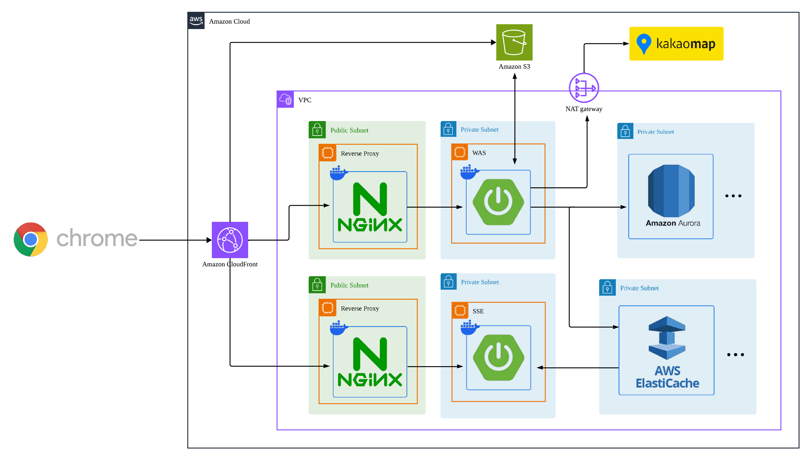
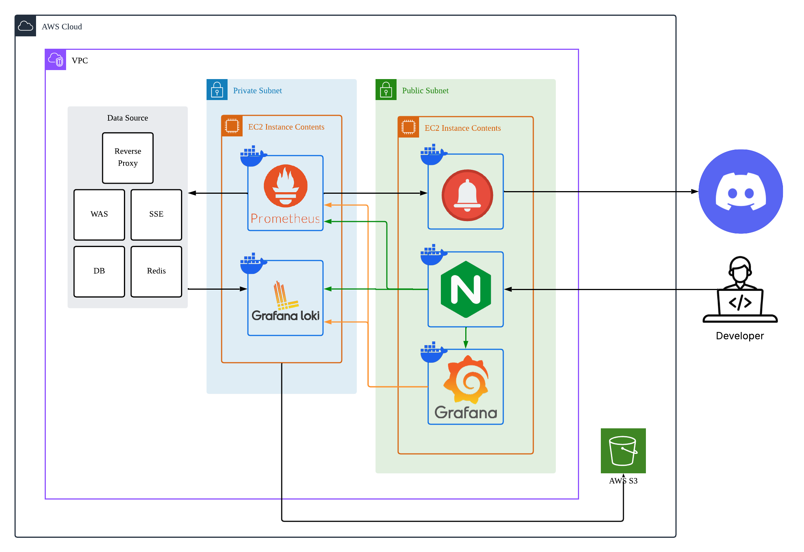
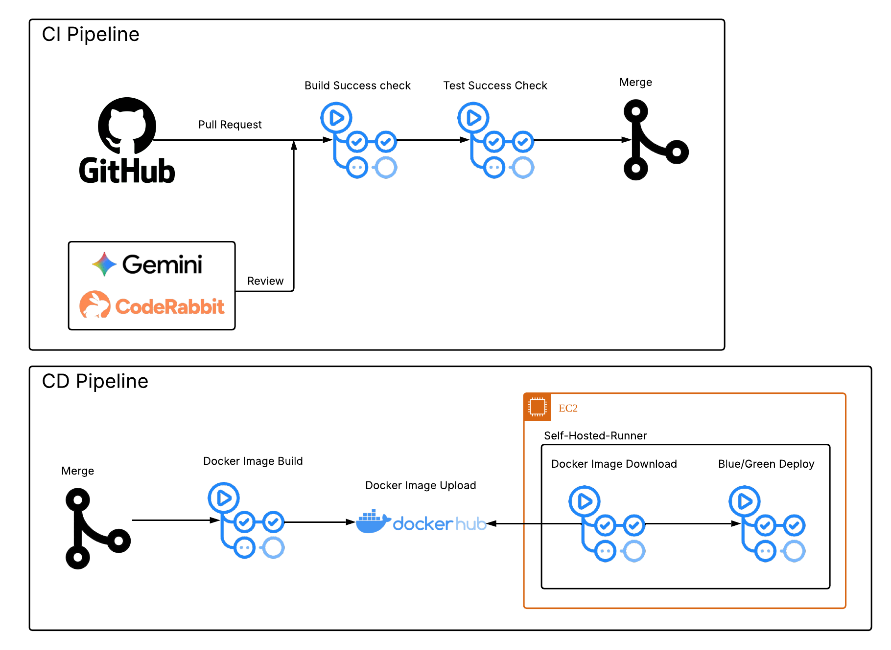
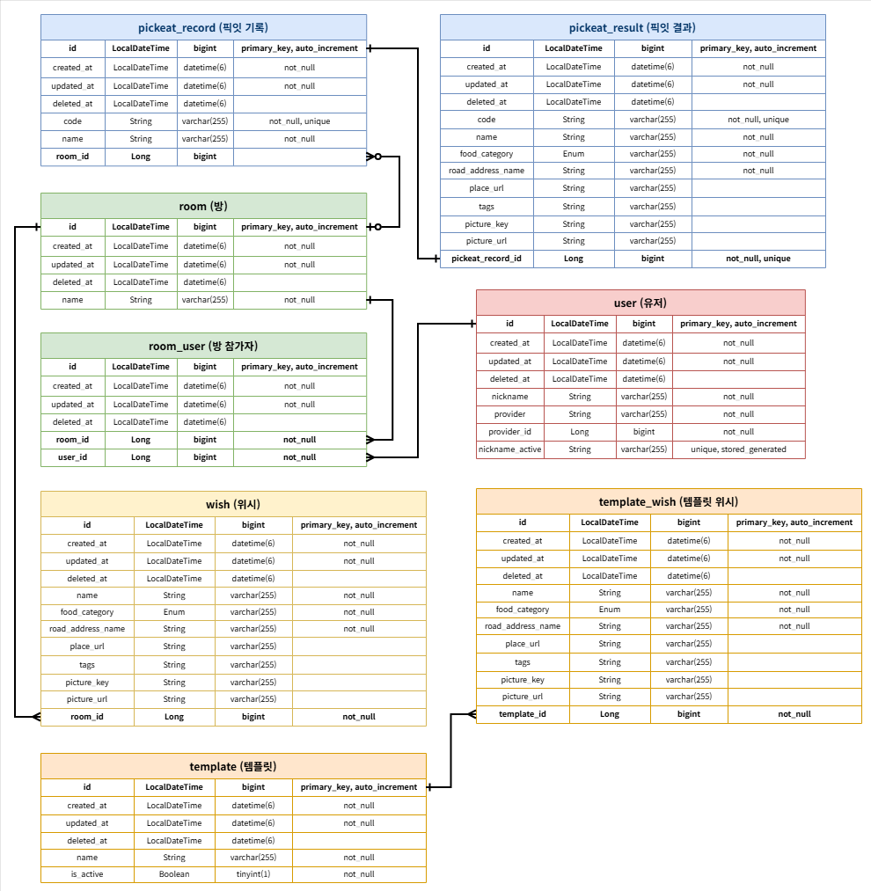

## 🧀 PickEat 서비스 소개

 

> **매번 반복되는 팀 식사 고민, 팀원들의 취향을 모두 담은 PickEat으로 결정하세요!**

"아무거나"라는 말 뒤에는 기피 음식, 식단 제한, 최근 먹은 메뉴 등 저마다의 조건이 숨어 있습니다. 이런 조건들이 맞물리면 소극적인 사람은 참고 넘어가고,
결국 모두가 아쉬운 선택으로 이어지곤 합니다.

PickEat은 이 문제를 해결하는 실시간 식당 투표 서비스입니다. 싫어하는 식당은 제거하고, 가고 싶은 식당에 좋아요를 누르는 간단한 투표 과정으로 구성원 모두가 만족하는
식당을 빠르고 합리적으로 결정할 수 있습니다.

반복되는 식사 고민, 이제 PickEat으로 해결하세요.

 

## 🤝 팀원 소개

### 프런트엔드 팀원

|                                                          머핀                                                          |                                                          수이                                                          |                                                          카멜                                                          |
|:--------------------------------------------------------------------------------------------------------------------:|:--------------------------------------------------------------------------------------------------------------------:|:--------------------------------------------------------------------------------------------------------------------:|
|  |  |  |
|                                        [GitHub](https://github.com/minji2219)                                        |                                         [GitHub](https://github.com/shuyeon)                                         |                                       [GitHub](https://github.com/dev-dino22)                                        |

### 백엔드 팀원

|                                                          몽이                                                          |                                                         슬링키                                                          |                                                          에드                                                          |                                                          랜디                                                          |
|:--------------------------------------------------------------------------------------------------------------------:|:--------------------------------------------------------------------------------------------------------------------:|:--------------------------------------------------------------------------------------------------------------------:|:--------------------------------------------------------------------------------------------------------------------:|
|  |  |  |  |
|                                        [GitHub](https://github.com/wodnd0131)                                        |                                       [GitHub](https://github.com/supernovaMK)                                       |                                        [GitHub](https://github.com/jinu0328)                                         |                                         [GitHub](https://github.com/KJungW)                                          |

 

## 🏗️ 아키텍쳐

### 운영 인프라 구조

### 모니터링 구조

### CICD 파이프라인

 

## 🗄️ 데이터베이스 구조

### ERD

### 인메모리 데이터 구조도
